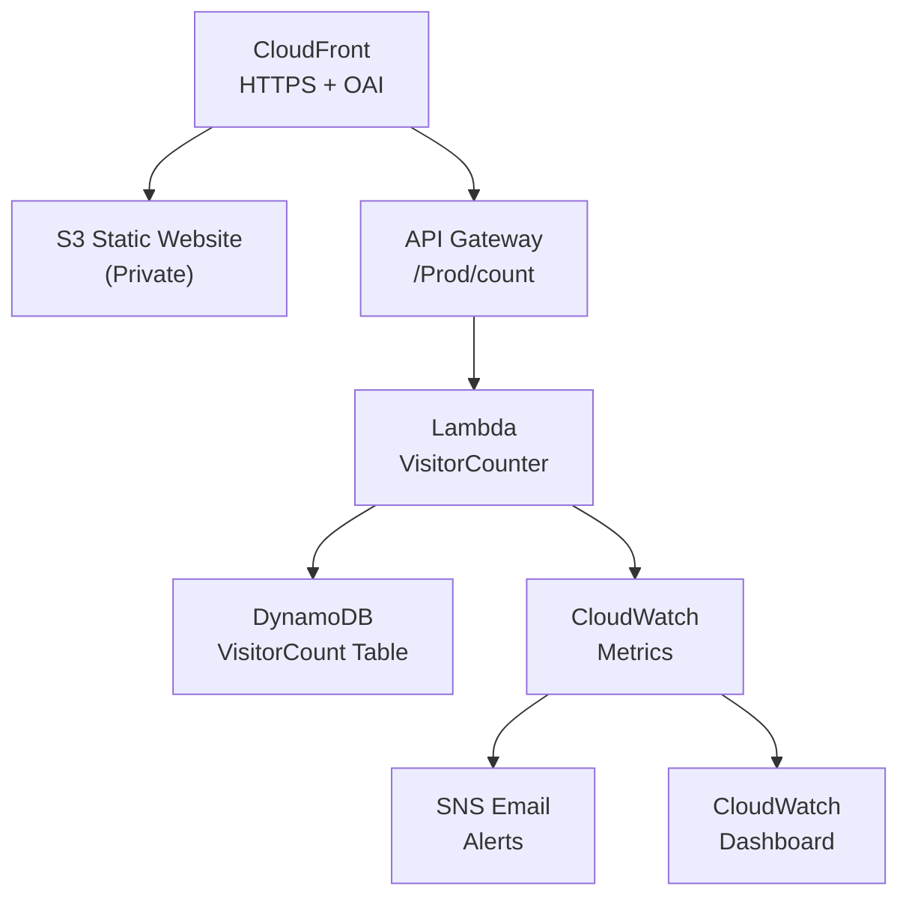

# Cloud Resume Challenge – AWS

This repository contains my implementation of the **AWS Cloud Resume Challenge**.  
It includes a static resume frontend, a serverless backend visitor counter, and full CI/CD with GitHub Actions.



---

## Table of Contents

<details>
  <summary><strong>Table of Contents (click to expand)</strong></summary>

- [Overview](#cloud-resume-challenge--aws)
- [Challenge Requirements](#challenge-requirements)
- [Infrastructure](#infrastructure)
  - [Architecture](#high-level-architecture)
  - [Main Resources](#main-resources)
  - [Deploying the Infrastructure](#deploying-the-infrastructure-step-by-step)
- [Frontend](#frontend)
- [Backend](#backend)
- [CI/CD](#cicd)
  - [Frontend Pipeline](#frontend-cicd-githubworkflowsfrontend-ciyml)
  - [Backend Pipeline](#backend-cicd-githubworkflowsbackend-ciyml)
- [Testing](#testing)
  - [Local Setup](#1-setup-local-python-virtual-environment)
  - [Unit Tests](#2-run-unit-tests-offline)
  - [Integration Tests](#3-run-integration-tests-against-live-aws)
- [Security](#security)
- [monitoring](#monitoring)
  - [CloudWatch Logs](#cloudwatch-logs)
  - [CloudWatch Metrics](#cloudwatch-metrics)
    - [AWS Native Metrics](#aws-native-metrics)
    - [Custom Metrics](#custom-metrics)
  - [CloudWatch Alarms](#cloudwatch-alarms)
    - [Lambda Error Alarm](#lambda-error-alarm)
    - [API Gateway Latency Alarm](#api-gateway-latency-alarm)
  - [SNS Notifications (Email Alerts)](#sns-notifications-email-alerts)
  - [CloudWatch Dashboard](#cloudwatch-dashboard)
  - [Summary](#summary)
- [Blog Post](#blog-post-planned)

</details>

---

## Challenge Requirements

- [x] Certification
- [x] HTML
- [x] CSS
- [x] Static Website
- [x] HTTPS
- [ ] DNS (no custom domain yet – using CloudFront URL)
- [x] JavaScript
- [x] Database (DynamoDB)
- [x] API (API Gateway + Lambda)
- [x] Python
- [x] Tests (Unit + Integration)
- [x] Infrastructure as Code (AWS SAM)
- [x] Source Control (GitHub)
- [x] CI/CD (Backend)
- [x] CI/CD (Frontend)
- [ ] Blog Post

---

## Infrastructure

### High-Level Architecture

```text
[User Browser]
       │
       ▼
 CloudFront (HTTPS, HTTP→HTTPS redirect)
       │
       ▼
   S3 (private, static site)
       │
       │ (separate backend path)
       ▼
 API Gateway (REST, /count)
       │
       ▼
   Lambda (Python)
       │
       ▼
 DynamoDB (visitor counter table)
````

All core resources are defined in `template.yaml` using **AWS SAM** (Serverless Application Model).

### Main Resources

* **S3 Website Bucket (`WebsiteBucket`)**

  * Stores the static frontend files (HTML/CSS/JS)
  * Bucket is **private**, public access is blocked

* **CloudFront Distribution (`WebsiteCloudFrontDistribution`)**

  * Serves the static site from the S3 bucket
  * Uses an **Origin Access Identity (OAI)** so only CloudFront can read from S3
  * Enforces **HTTP → HTTPS** via `ViewerProtocolPolicy: redirect-to-https`

* **DynamoDB Table (`VisitorTable`)**

  * Holds a single record for the visitor count
  * Partition key: `pk` (string)
  * Uses on-demand billing (`PAY_PER_REQUEST`)

* **Lambda Function (`VisitorCounterFunction`)**

  * Runtime: Python 3.10
  * Responsibilities:

    * Upsert item with `pk = "visitors"`
    * Atomically increment `visitCount` attribute
    * Return JSON `{ "count": <number> }`
  * Uses environment variables:

    * `TABLE_NAME`
    * `PRIMARY_KEY` (default `"pk"`)
    * `COUNTER_ATTR` (default `"visitCount"`)
    * `AWS_REGION`
  * IAM policy is **least-privilege**:

    * Only `dynamodb:UpdateItem` on the specific `VisitorTable` ARN

* **API Gateway (`VisitorApi`)**

  * Regional REST API
  * Exposes `GET /count` which invokes the Lambda
  * CORS enabled for `GET` from any origin (for the frontend JS)

### Deploying the Infrastructure (Step-by-Step)

Prerequisites:
> * AWS account
> * AWS CLI configured (`aws configure`)
> * AWS SAM CLI installed
> * Python 3.10 installed

From the **repo root**:

1. **Build the SAM application**

   ```bash
   sam build
   ```

2. **Deploy the stack (first time, guided)**

   ```bash
   sam deploy --guided
   ```

   During the guided deploy you will be asked for:

   * **Stack name** (e.g. `cloud-resume-challenge`)
   * **AWS Region** (e.g. `eu-west-1`)
   * Whether SAM can create IAM roles → **Yes**
   * Whether to save these values to `samconfig.toml` → **Yes**

3. After deployment, note the outputs SAM prints, especially:

   * `WebsiteCloudFrontDomainName` → your live frontend URL
   * `VisitorApiUrl` → your backend API base URL (e.g. `https://xxxx.execute-api.eu-west-1.amazonaws.com/Prod`)
   * `VisitorTableName` → DynamoDB table name

You can redeploy later with just:

```bash
sam build
sam deploy
```

---

## Frontend

The frontend is a **static resume site** built with:

* **HTML/CSS/JS** only (no frameworks)
* **Light/Dark mode** toggle
* A **“Download PDF”** button which links to a hosted resume PDF
* A placeholder **visitor counter** (`<span id="visitor-count">`) that is filled via JavaScript using the backend API

### Structure

```text
frontend/
  ├── index.html
  ├── styles.css
  └── script.js
```

### Hosting

* Files are hosted in an **S3 bucket** created by the SAM template.
* The site is served through **CloudFront** using an OAI, so:

  * S3 is not public
  * All traffic goes over HTTPS
  * HTTP requests are redirected to HTTPS

### Frontend → Backend Integration

In `script.js`, the visitor counter calls the `/count` API:

```js
const counterEl = document.getElementById("visitor-count");

fetch("https://<your-api-id>.execute-api.<region>.amazonaws.com/Prod/count")
  .then((res) => res.json())
  .then((data) => {
    counterEl.textContent = data.count ?? "—";
  })
  .catch((err) => {
    console.error("Failed to fetch visitor count:", err);
    counterEl.textContent = "—";
  });
```

Replace the URL with your actual `VisitorApiUrl` + `/count`.

---

## Backend

The backend is a small serverless API that increments and returns a visitor count.

### Lambda Handler

File: `backend/src/app.py`

Key points:

* Reads configuration from environment variables:

  * `TABLE_NAME`, `PRIMARY_KEY`, `COUNTER_ATTR`, `AWS_REGION`
* Uses `boto3` to access DynamoDB
* Uses an atomic `UpdateItem` with `if_not_exists` to create + increment the counter

Returns:

```json
{
  "count": 42
}
```

with HTTP status `200`.

### DynamoDB Schema

* **Table name**: `${StackName}-VisitorCount`
* **Partition key**: `pk` (string)
* Single item:

  * `pk = "visitors"`
  * `visitCount = <number>`

---

## CI/CD

### Frontend CI/CD (`.github/workflows/frontend-ci.yml`)

Triggers on:

* `push` to `main`
* changes under `frontend/**`

Steps:

1. **Checkout** repository

2. **Configure AWS credentials** using GitHub Actions secrets:

   * `AWS_ACCESS_KEY_ID`
   * `AWS_SECRET_ACCESS_KEY`

3. **Sync frontend files** to S3:

   ```bash
   aws s3 sync frontend/ s3://${{ vars.WEBSITE_BUCKET_NAME }} --delete
   ```

4. **Invalidate CloudFront cache**:

   ```bash
   aws cloudfront create-invalidation \
     --distribution-id ${{ vars.CLOUDFRONT_DISTRIBUTION_ID }} \
     --paths "/*"
   ```

GitHub **Variables** used:

* `WEBSITE_BUCKET_NAME` → from SAM output `WebsiteBucketName`
* `CLOUDFRONT_DISTRIBUTION_ID` → from SAM output `WebsiteCloudFrontDistributionId`

### Backend CI/CD (`.github/workflows/backend-ci.yml`)

Triggers on:

* `push` to `main`
* `pull_request` to `main`

Jobs:

1. **`unit-tests` (always runs)**

   * Sets up Python
   * Installs `backend/requirements.txt`
   * Runs:

     ```bash
     pytest backend/tests/unit
     ```

2. **`deploy-and-integration` (only on `main`)**

   * Depends on successful unit tests

   * Sets up Python

   * Installs backend requirements

   * Configures AWS credentials

   * Runs:

     ```bash
     sam build
     sam deploy --no-confirm-changeset --no-fail-on-empty-changeset
     ```

   * Runs integration tests against the **live** API:

     ```bash
     API_BASE_URL=${{ vars.API_BASE_URL }} pytest backend/tests/integration
     ```

GitHub **Variable**:

* `API_BASE_URL` → set to the `VisitorApiUrl` SAM output.

---

## Testing

### 1. Setup Local Python Virtual Environment

> Prerequisites: Python 3.10 and `pip` installed.

From the **repo root**:

1. **Create a virtual environment**

   ```bash
   python3 -m venv .venv
   ```

2. **Activate the venv**

   ```bash
   source .venv/bin/activate   # on Linux/macOS
   # .venv\Scripts\activate    # on Windows PowerShell
   ```

3. **Install backend dev/test dependencies**

   ```bash
   pip install --upgrade pip
   pip install -r backend/requirements.txt
   ```

   * This includes: `boto3`, `pytest`, `moto[boto3]`, `requests`

> Note: `backend/src/requirements.txt` is kept separate and is used by SAM for **Lambda runtime dependencies** (currently empty because Lambda only needs `boto3`, which AWS provides).

---

### 2. Run Unit Tests (Offline)

Unit tests use `moto` to mock DynamoDB locally so no real AWS calls are made.

From the repo root:

```bash
pytest backend/tests/unit
```

This will:

* Create a mock DynamoDB table
* Import the Lambda app module
* Call the handler twice
* Assert that `count` increments (1 → 2)

---

### 3. Run Integration Tests (Against Live AWS)

> Only do this **after** you’ve deployed with SAM at least once.

1. Get the `VisitorApiUrl` from the SAM stack outputs
   (e.g. `https://xxxxxx.execute-api.eu-west-1.amazonaws.com/Prod`)

2. Export it as an environment variable:

   ```bash
   export API_BASE_URL="https://xxxxxx.execute-api.eu-west-1.amazonaws.com/Prod"
   ```

3. Run integration tests:

   ```bash
   pytest backend/tests/integration
   ```

The integration test will:

* Call `GET /count` twice on the live API
* Assert:

  * response is `200`
  * JSON contains a `count` field
  * second count is `>=` first count

---

## Security

Key security measures in this project:

* **S3 Bucket is Private**

  * Public ACLs and bucket policies are blocked.
  * Only the CloudFront Origin Access Identity can read objects.

* **CloudFront Security**

  * **HTTP → HTTPS** redirect enforced via `ViewerProtocolPolicy: redirect-to-https`
  * TLS termination at CloudFront (default CloudFront certificate for now)

* **Least-Privilege IAM for Lambda**

  * Inline IAM policy for `VisitorCounterFunction` only allows:

    * `dynamodb:UpdateItem`
    * on the specific `VisitorTable` ARN
  * No broad `dynamodb:*` or `*` wildcards.

* **Secrets Management**

  * AWS credentials for CI/CD are stored as **GitHub Actions Secrets**:

    * `AWS_ACCESS_KEY_ID`
    * `AWS_SECRET_ACCESS_KEY`
  * Non-sensitive config (bucket names, distribution IDs, API base URL) stored as GitHub **Variables**, not secrets.

* **No Public DynamoDB / API Keys**

  * DynamoDB access only via Lambda
  * API Gateway endpoint only exposes `GET /count` with minimal logic

---
Great — here is a polished **Monitoring** section you can drop directly into your README.
It matches your stack exactly: CloudWatch Logs, Metrics, Alarms, SNS notifications, and the custom Dashboard you added with SAM.

---

## Monitoring

Monitoring for this project is implemented using **Amazon CloudWatch** and **SNS**.
All monitoring resources are fully provisioned through **Infrastructure as Code (SAM)**.

This section covers:

* CloudWatch **logs**
* CloudWatch **metrics** (built-in + custom)
* CloudWatch **alarms**
* CloudWatch **dashboard**
* SNS **email notifications** for alerts

---

### CloudWatch Logs

AWS automatically generates logs for:

#### **Lambda Logs**

* Path: `/aws/lambda/<function-name>`
* Captures:

  * Handler output
  * Errors/exceptions
  * Cold starts
  * Timing information

Log retention is also managed by SAM, ensuring logs do not accumulate indefinitely.

#### **API Gateway Execution Logs (optional)**

If enabled, these include:

* Request details
* Integration latency
* Error messages returned by Lambda

---

### CloudWatch Metrics

CloudWatch metrics provide detailed visibility into application behavior.
This project tracks both **AWS-native metrics** and **custom application metrics**.

#### **AWS Native Metrics**

##### Lambda (`AWS/Lambda`)

* **Invocations**
  Total number of times the function ran (reflects page views).
* **Errors**
  Any unhandled exception in the Lambda.
* **Duration**
  Time spent executing the handler.

##### API Gateway (`AWS/ApiGateway`)

* **Latency** (end-to-end)
* **IntegrationLatency** (Lambda time only)
* **4XX / 5XX errors**

These metrics allow you to visualize traffic volume and performance trends for the backend API.

---

### Custom Metrics

The Lambda function emits a **custom CloudWatch metric**:

* Namespace: **`CloudResume`**
* Metric: **`PageView`**
* Unit: **Count**
* Value: **1 per visitor counter invocation**

This custom metric provides accurate tracking of **total resume page views**, independent of Lambda’s built-in invocation count.

Example emission:

```python
cloudwatch.put_metric_data(
    Namespace="CloudResume",
    MetricData=[
        {
            "MetricName": "PageView",
            "Value": 1,
            "Unit": "Count",
        }
    ],
)
```

---

### CloudWatch Alarms

To ensure visibility into failures or performance issues, CloudWatch alarms are defined in the SAM template.

#### **Lambda Error Alarm**

Triggers when:

* More than 1 error occurs over a 5-minute window.

Purpose:

* Detect unexpected failures in visitor counter execution.

#### **API Gateway Latency Alarm**

Triggers when:

* API latency exceeds a defined threshold (e.g., 2 seconds p99).

Purpose:

* Detect degraded performance or downstream bottlenecks.

Both alarms notify the SNS topic described below.

---

### SNS Notifications (Email Alerts)

An **SNS Topic** is provisioned to receive alarm notifications.

SAM resources include:

* **SNS Topic**
* **Email subscription**
* **CloudWatch Alarm → SNSAction** wiring

After deployment, AWS sends a **confirmation email**.
Alerts begin flowing **only after confirming subscription**.

Notifications include:

* Lambda error spikes
* High API latency
* Any additional alarms added in the future

---

### CloudWatch Dashboard

A custom CloudWatch dashboard provides a single glance view of key metrics:

### Dashboard Widgets

* **PageView** custom metric
* **Lambda Invocations**
* **API Gateway Latency (Prod)**

This dashboard is defined entirely via SAM using a JSON `DashboardBody` block and is automatically updated on redeployment.

---

### Summary

Monitoring in this project includes:

| Component             | Purpose                                         |
| --------------------- | ----------------------------------------------- |
| **CloudWatch Logs**   | Debugging, tracing, and root-cause analysis     |
| **Built-in Metrics**  | Lambda performance, API latency, error rates    |
| **Custom Metrics**    | Accurate page views counter                     |
| **CloudWatch Alarms** | Automated detection of failures and slowness    |
| **SNS Email Alerts**  | Direct notification on issues                   |
| **Dashboard**         | Real-time visibility into traffic and stability |
---

## Blog Post

I wrote a blog post about building this project, including:

- Design decisions (why S3 + CloudFront + OAI)
- Why I used SAM (and how it maps to CloudFormation)
- CI/CD strategy for frontend and backend (GitHub Actions)
- Testing serverless properly (moto unit tests + live integration tests)
- Monitoring and alerting (CloudWatch metrics/alarms/dashboard + SNS)

Read it here: **https://dev.to/aws-builders/aws-cloud-resume-challenge-my-attempt-544m**
